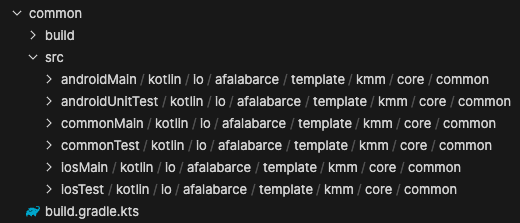
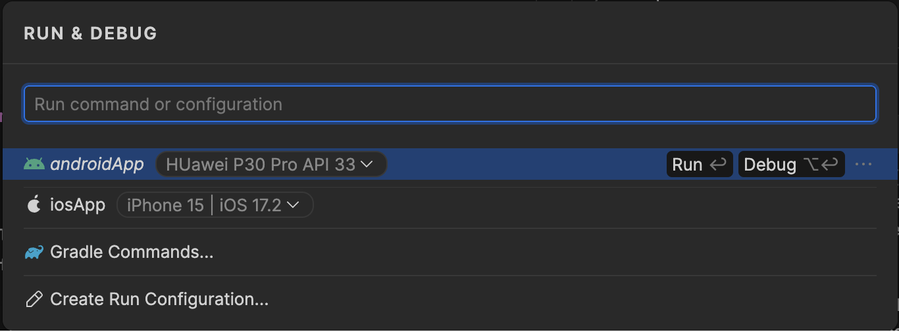
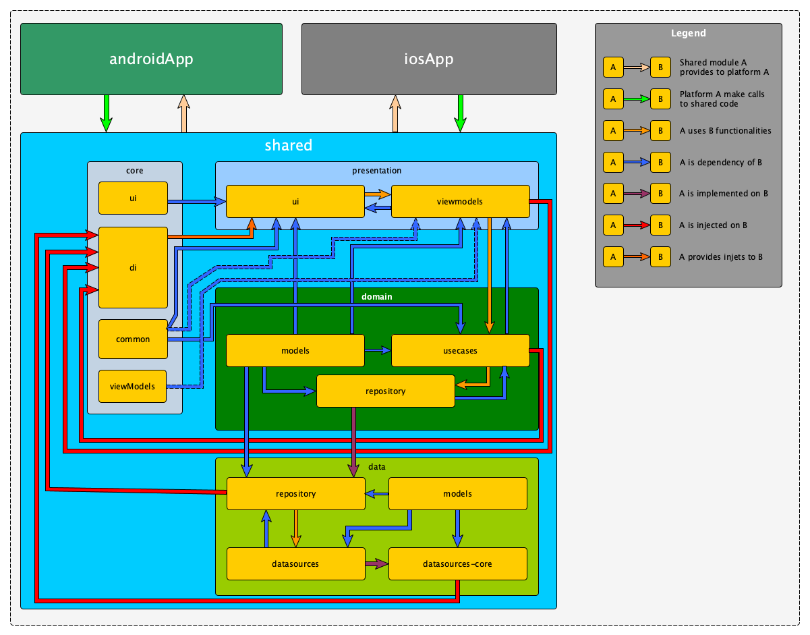
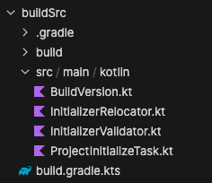
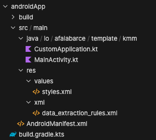
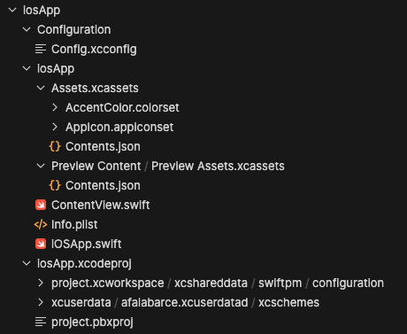
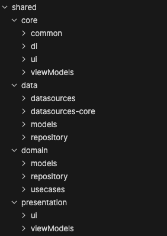
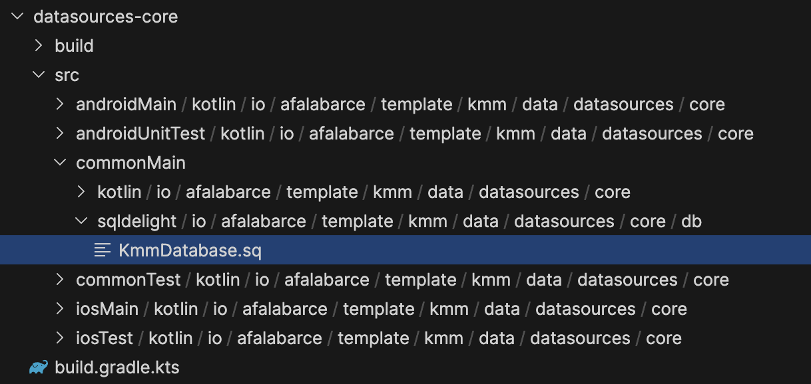

# KMM Template (Android + iOS)

## Introduction

This template is designed to facilitate the development of cross-platform applications, using
the framework [KMP (Kotlin MultiPlatform)](https://kotlinlang.org/docs/multiplatform.html). Also I know
has provided the necessary dependencies so that, **using a single code base**, we can
build both business and presentation layers.

For the presentation layer, the necessary dependencies have been added to be able to design the
user interfaces using [JetpackCompose Multiplatform](https://www.jetbrains.com/lp/compose-multiplatform/),
which will result in greater control, and above all, a common code base in which we will not have to
design specific UIs for each platform.

Below, both the preconfigurations to be made and an exhaustive explanation will be explained.
of what the template offers in terms of architecture, libraries and deployed functionalities.

This template has been created from scratch, focusing on clarity and organization of the code, in order to
makes learning this exciting technology easier.

## Previous Configuration

The first time we create a multiplatform project, we will need several previous configurations, in which
MacOS environments (development for iOS has its little things), which will help us in the correct configuration
of the system, avoiding later compilation errors. Therefore, we must pay special attention to
The next points:

- **Common to all Operating Systems (Windows, MacOs, Linux)**:
    - Install JDK 17, if we do not have it installed yet.
    - Add a local.properties file to the root of the project in which we establish the path
      to the Android SDK.
    - Add the
      plugin [Kotlin Multiplatform Mobile plugin](https://plugins.jetbrains.com/plugin/14936-kotlin-multiplatform-mobile)
      in case we use IntelliJ Idea or Android Studio. This template comes prepared
      for [Fleet](https://www.jetbrains.com/es-es/fleet/) (it has been designed specifically with this new IDE), which
      KMP has already been implemented as standard
- **Specific on MacOs systems (for iOS development)**:
    - Check that the system meets the minimum requirements for KMP developments for iOS with
      [KDoctor](https://github.com/Kotlin/kdoctor).

## Structure of a KMP module

Every project defined for **K**otlin **M**ulti**P**latform has a clearly defined structure, which,
will allow
the generation of custom code on each platform, having the possibility of, for example, defining a function
in a common way but that,
Depending on the platform, it must be initialized in one way or another.

Let's see below the typical structure for a KMP module (in this case, for a module that supports the platforms
Android and iOS):



Each folder defined in the module will contain exactly the same folder structure (package), so that in the
in case we need to redefine a class or a
functionality, we can do it without major problems. Below we will specify what each does and what it is for.
one (although it's pretty clear based on the names):

- **androidMain**, contains Android-specific definitions and code. In this section we must initialize everything
  what is necessary for the Android platform, that is, here in case you have to instantiate some type of object that
  requires a Context or any other specific API of Android, it can be done here without any major problem.
- **androidTest**, contains unit test implementations that require specific Android elements. Of
  this way, if in [androidMain] we have instantiated some specific object, we can test it here.
- **commonMain**, in this module is where we are going to have the bulk of implementations, as well as the expect class
  whose Implementation is delegated to each platform.
- **commonTest**, contains unit test implementations that do not require specific elements of a platform.
- **iosMain**, contains, **in Kotlin language**, specific implementations for the iOS platform, will be implemented
  specific initializations of objects, or access to api t implements KMP.
- **iosTest** contains unit test implementations that require specific elements or instances.
  iOS platform. It is used as in [iosMain] the Kotlin-Swift bridge.

### Definitions expect

In KMP the use of functions or classes marked with the reserved word **expect** is introduced, or becomes necessary,
These functions and/or classes are defined in the module
[commonMain], but are implemented on each platform, marking their implementation with the keyword **current**. TO
Keep in mind that, to carry out the implementation, it is required
of a particular nomenclature, for example, if in [commonMain] we have the file (defined by its
package) [dev.afalabarce.template.kmm.data.datasources.core.db.DriverFactory.kt]
On the rest of the platforms, we must define a file that will be the one in which we will implement the class (
or expect function) that we require:

- **[dev.afalabarce.template.kmm.data.datasources.core.db.DriverFactory.android.kt]**, the implementation of
  the class/functions using android's own elements.
- **[dev.afalabarce.template.kmm.data.datasources.core.db.DriverFactory.ios.kt]**, the implementation of the
  class/functions using the Kotlin - Swift bridge provided by KMP.

Let's look at an example, precisely with the file proposed as an example:

#### Definition in commonMain

```kotlin
expect class DriverFactory {
    fun createDriver(): SqlDriver
}
```

#### Implementation for Android platform

```kotlin
current class DriverFactory {
    private val context: Context by inject(Context::class.java)
    current
    fun createDriver(): SqlDriver {
        return AndroidSqliteDriver(
            KmmDatabase.Schema,
            this.context,
            Database.databaseName
        )
    }
}
```

#### Implementation for iOS platform

```kotlin
current class DriverFactory {
    current
    fun createDriver(): SqlDriver {
        return NativeSqliteDriver(
            KmmDatabase.Schema,
            Database.databaseName
        )
    }
}
```

As we see in each implementation a KmmDatabase class is used, this class is generated by the compiler,
since it is that name that we have given in the gradle configuration for the database based on SqlDelight.

As we can see, once we mark the class **DriverFactory** as expect, all its implementations must go
marked as current, as well as the functions or properties it may contain.

## Execution of the App on the different platforms (Android and iOS)

Two execution tasks are defined (one per platform):

- androidApp, allows us to run the app on an android system.
- iosApp, allows us to run the app in an iOS emulator.

If we are using Jetbrains Fleet, to launch the execution of the app the process consists of two
parts, whether we execute the process visually or if we launch it using keyboard shortcuts:



We must keep in mind that, as we execute tasks (for example unit tests, etc.), this dialog will grow
and will show a list of recent tasks that are intended to be relatively useful to the developer.

- **Visual execution**. We will click on the **▷** button. and then on the Run or Debug option, taking into account
  that, with Fleet versions greater than 1.31, we can select emulator to use (both for Android and iOS).

- **Execution using keyboard shortcuts**, by pressing ⌘ + R we access the previous dialog,
  for then using ⌥ + ↵. If we do not select an emulator, the app will run with the default emulator.

For Android Studio, the execution is similar to any Android app execution:


## Publication of the apps

The Jetbrains website indicates the deployment process for both Android and Android apps.
like iOS, so its description in this tutorial is unnecessary:

[App publishing process](https://www.jetbrains.com/help/kotlin-multiplatform-dev/multiplatform-publish-apps.html)

## Project Architecture

The Architecture of this project is based on the classic Clean Architecture, with some
particularities that, I think, make it interesting both at a didactic and productive level,
since it provides a total separation of each layer, allowing maximum decoupling
in each section. So, in a schematic way (without going into the internal structure
created for KMP), we can see all the modules defined in the following image:



As we can see, the project is divided into three large blocks:

- **androidApp**, contains the specific configuration for the Android app.
- **iosApp**, contains the specific configuration for the iOS app.
- **shared**, contains all the project code that will be shared for
  both platforms.

Additionally, we have a fourth "module", not dependent on KMP, intended for the management
of configurations and creation of custom tasks for gradle:

- **buildSrc**, contains different configuration elements, as well as the code of certain
  Gradle tasks that will allow us to customize our project to our liking.

Below we will see each block in detail:

### <ins>buildSrc</ins>

This module is the classic gradle module in which all
the configurations necessary for the correct functioning of the app.

In addition, it contains a gradle DefaultTask type class that will allow us to generate a new project
from this with the parameters that we will define in its execution.



Let's look at each of these files that we have just presented in detail:

- **buildSrc/src/main/kotlin/BuildVersion.kt**. This object contains relevant information (which we will use
  in the build.gradle.kts of each layer) for the configuration of the execution and compilation environment of the app.
  Thus, it will allow us to configure all the important parameters in a single point (such as, for example, the
  package prefix that all layers must have, and which will match the applicationId of the app).

- **buildSrc/src/main/kotlin/ProjectInitializeTask.kt**. This file contains the class responsible for cloning
  This template, to adapt it to the needs of the project that we are going to develop, its use is tremendously
  simple, at the same time (humbly) powerful. A couple of other classes depend on this class (in their respective
  files) that will serve as support for us, to simplify the development of this Task for gradle.
  Let's see it with an example:

```bash
# ./gradlew -q initializeKmmProject
Project Initializer Task Help
-------------------------------
This task can relocate packages and folders from source package to destination package
- appName, New project Application Name (By Default KMM Template)
- destinationPath, Destination path for the new project(sibling to root project dir), can't be empty, can't exists, and not equals to current template project dir
- sourcePackage, Source package from template, by default dev.afalabarce.template.kmm
- destinationPackage, Destination package for the template, can't be empty, and not equals to sourcePackage

Usage:
./gradlew -q initializeKmmProject \
        --appName="Your Awesome App Name" \
        --destinationPath="your-new-project-root" \
        --sourcePackage="dev.afalabarce.template.kmm" \
        --destinationPackage="io.github.afalabarce.awesomeapp"
-------------------------------
ERROR: Destination path can not be empty
ERROR: Deploy package can not be empty
ERROR: Destination path can not exists


FAILURE: Build failed with an exception.
```

As we can see, the task has three **mandatory** parameters, in case of not completing them correctly,
The help message is shown to us, as well as the errors produced.

With this task, the project initialization process is considerably reduced.

### <ins>androidApp</ins>

This module is responsible for launching our app for the Android platform, this means that it is a module
Typical Android App, in which, for example, we will establish the app icon, as well as its name and permissions
necessary
(although this last point may be inherited from the merge that will be done when compiling the different manifests in
each
module).



As we can see, there is nothing special about this module, with the exception that
in the MainActivity file it makes the relevant call to the composable of the app that we have defined in our module
**:presentation:ui**:

```kotlin
package io.afalabarce.template.kmm

import android.os.Bundle
import androidx.activity.ComponentActivity
import androidx.activity.compose.setContent
import io.afalabarce.template.kmm.presentation.ui.App

class MainActivity : ComponentActivity() {
    override fun onCreate(savedInstanceState: Bundle?) {
        super.onCreate(savedInstanceState)
        setContent {
            App()
        }
    }
}
```

### <ins>iosApp</ins>

This module contains everything necessary for the compilation and subsequent publication of the iOS version of the app,
We have the typical structure of a project developed for XCode, using Swift as the language, and internally as a
framework for SwiftUI UI, although in the case of this template, it is a mere bridge to call the App() function which
will contain all the UI logic. Please note that to facilitate the configuration work (team development, etc. We have a
configuration file, which we must expand in order to enhance the parameterization of the entire setting of the app).



As we can see, we have, in the Configuration folder, the file **Config.xcconfig**, in which we are going to save
certain configuration parameters that are going to be repeated, that is, app name, bundleId, teamId, etc.

The rest of the files contain both the configuration (Info.plist) and the project code in Swift. To keep in mind
Keep in mind that in the event that we need to add some additional code (for example integrations with firebase,
permissions extra, etc) we will have to add delegates in the IOSApp.swift file, in a typical way, but for this, **we
will not have to get out of Fleet, since Fleet offers support for Swift, both at the code writing and debugging level**.

### <ins>shared</ins>

The shared block is the one that contains ALL the common logic of the app, that is, both the business and application
layers.
ui, taking into account that the previous androidApp and iosApp blocks are nothing more than containers to allow
the execution of all common code. Thus, in this block we implement the entire
[]Clean Architecture](https://blog.cleancoder.com/uncle-bob/2012/08/13/the-clean-architecture.html), although with a
a bit particular approach (my own approach, which probably won't match yours).

Based on the previous scheme, we can see that each layer of the Clean Architecture is in turn composed of various
modules that allow us to completely encapsulate and isolate each responsibility, avoiding unauthorized access
by one layer to another to which it should not have access.



Let's look at each layer and their respective modules in detail:

- **core**, is a transversal layer, which has modules accessible to specific layers, for specific actions
  but at the same time, it has visible modules for all layers, which provide functionalities that
  They can be of common use. Let's look at each of the modules that make up this layer:
    - *common*, this module is visible to all layers and provides useful methods that can be used in
      any of the project layers (for example, it provides methods that tell us the system in which
      run the app).
    - *viewmodels*, this module is only visible by the viewmodels module of the **presentation** layer, and provides
      Basic functionality for management and manipulation of states in viewmodels.
    - *di*, this module only collects the different dependency injection objects of each module, to
      provide them to the **ui module of the presentation layer**, in order to correctly manage the tree of
      dependencies.
    - *ui*, this module is only visible by the **ui module of the presentation layer**, it is provided in this module
      both the JetpackCompose theme and general purpose composables. Ideally, this layer should host abstractions
      of the components to use, since in this way, if any compose element is modified, the main UI will not
      Will be affected. For example, we can develop the composables of TextField, Button, PasswordTextField, etc.
      adapted to the theming that we require.
- **data**, this layer is responsible for managing **all** the data sources from which the
  app. Ideally, it will even manage possible data collection from GPS, Bluetooth, etc., in addition to the classic ones.
  requests to REST services, local databases, preferences management, etc. Next, we discuss the
  functionality and responsibility of each of the modules that make up this layer:
    - *models*, this module maintains, ideally separated by feature, the data models of both databases
      local and remote.
    - *repository*, in this module **the repository interfaces defined in the domain module are implemented:
      repository**, is also responsible for the implementation / definition of the different mappers to/from
      domain entities (**domain:models**) to database or remote entities.
    - *datasources*, in this module the interfaces that will manage each and every one of the requests to
      Data Sources. This module is **referenced by the data:repository module**.
    - *datasources-core*, this module is responsible for centralizing all interface implementations
      defined in **data:datasources**, therefore being the **only module in the entire project with the capacity to
      connection to external systems and/or local databases**.
    - **domain**, In this layer we manage the business logic that brings together the methods of the repositories in the
      different types of use case, in order to limit and atomize the requests, to use only and exclusively the
      necessary functionalities at a given time.
        - *models*, in this module we will define, ideally, by feature the different domain data models, which will be
          used by the presentation layers and that are provided to us already mapped from the repositories.
        - *repository*, in this module the communication interfaces that will be implemented in the module are defined
          **data:repository**. These interfaces are, ultimately, the communication contract between the access layer to
          data and presentation layer.
        - *usecases*, this module is responsible, organizing everything by feature, for the abstraction of the calls of
          the repositories, limiting each use case to a specific functionality, this means that a use case does not You
          should implement more than one functionality, e.g. GetDeviceIdUseCase, SetDeviceIdUseCase, etc.
- **presentation**, this is the layer responsible for interaction with the user, in which we will define both the UI
  as the system for obtaining data from the domain layer, through ViewModels.
    - *viewmodels*, this module is responsible, organized by feature, for managing the different requests and
      manipulation of data and states, based on use cases, through the **domain:usecases** module,
      providing the UI with information reactively, thereby ensuring that, apart from the UI not
      will be frozen, we will have a single point of data collection and updating.
    - *ui*, this module will be in charge of presenting the information provided by the different viewmodels
      defined in the module **presentation:viewmodels**, we should pay attention that ideally **we should not use
      components generic components of compose, in favor of our own components**, since in this way, we will be able to
      extract the responsibility for future changes in functionality or appearance to a single point.

At this point, we have defined what each module does in each layer, but it remains to explain / define what is stated in
the graphic scheme.

Let's see by module what its dependencies are:

- **Practically all modules** depend on core -> common, so it is not necessary to indicate this dependency.
- **domain -> repository**, requires the inclusion of the following dependencies:
    - *domain -> models*, since [domain -> repository] is where the interfaces that will be provided by the
      data obtained from the different data sources already mapped to the domain entities defined in this layer.
- **domain -> usecases**, the following dependencies are defined in this module:
    - *domain -> models*, since [domain -> usecases] has domain entities as return values, it requires
      this module to be able to carry out this work.
    - *domain -> repository*, the use cases defined in [domain -> usecases] require the data that is
      will be returned from the functions that are defined in the interfaces described in this module.
- **data -> datasources**, has the following dependencies:
    - *data -> models*, since it requires the data models (local and remote)
- **data -> datasources-core**, requires the following dependencies:
    - *data -> datasources*, since it is in [data -> datasources-core] where the implementation of the
      interfaces defined in this module.
    - *data -> models*, since it requires the data models (local and remote) for the implementation of the
      interfaces defined in the previous point.
- **data -> repository**, requires the following dependencies:
    - *data -> datasources*, since it is [data -> repository] where the interpretation of the results of
      datasources and their adaptation to domain entities.
    - *data -> models*, since it uses and is required by the results provided by the previous dependency.
    - *domain -> models*, since it is in [data -> repository] where the mapping of data entities (local and
      remote) to domain entities.
    - *domain -> repository*, since [data -> repository] is where the interfaces defined in this are implemented
      module.
- **presentation -> viewmodels**, this layer requires the following dependencies:
    - *domain -> models*, in the presentation and domain layers, we only collect data based on the entities of
      domain defined in this module.
    - *domain -> usecases*, the viewmodels have as their only data source the results provided by the
      different use cases defined in this module.
    - *core -> viewmodels*, this dependency provides certain functionalities that can be used by the
      [presentation -> viewmodels] module.
- **presentation -> ui**, the presentation layer has the following dependencies:
    - *domain -> models*, in the presentation layer, we only collect data based on the domain entities
      defined in this module.
    - *presentation -> viewmodels*, the presentation layer, obtains and provides feedback to data resources both
      local and remote **only through the related viewmodels**.
    - *core -> di*, since the dependency provider (Koin) must be managed from the presentation layer it is necessary
      pass the dependency tree aseptically, which we achieve by including this dependency and an object
      concrete that defines the entire tree.
    - *core -> ui*, thanks to this module, we are going to centralize all the appearance and theming of the app, to do
      this, it is in
      this module where the theme of the app will be defined, as well as the basic components (already with the theme
      values
      applied) that are going to be used in the app.

As we can see, based on the description of the different dependencies that we have defined, we have the security
that each layer is only visible by the correct layer/module completely avoiding possible improper access, either
intentionally or mistakenly.

## Functionalities implemented (per layer)

### Core

In the core layer, some of the basic functionalities of the entire app are implemented, particularly the
different elements that will allow us to manage both the dependency injection tree and the management of
Viewmodels. Let's see, for each module, the most interesting possibilities it provides us:

#### Common

This module defines one of the most important functionalities of the entire project, since it allows us to manage
relatively simple way the entire process of providing dependencies throughout the project (hence this module
be a direct dependency on the rest of the modules of the project).

In the package [io.afalabarce.template.kmm.core.common.di] the interface **KoinModuleLoader** is defined, which
exposes a read-only property called **modules**, which is nothing more than a list of koin modules.
We will implement this interface in each module that requires dependency injection, for example,
[data -> datasources-core], [data -> repository], [domain -> usecases] and [presesntation -> viewmodels].

Its use is very simple, let's see it with a code example (extracted from [data -> datasources-core]):

```kotlin
object DataSourceCoreDependencyInjector : KoinModuleLoader {
    override val modules: List<Module>
        get() = getPlatformInjects().union(
            listOf(
                module {
                    single<ApiService> {
                        Ktorfit
                            .Builder()
                            .baseUrl(ApiService.API_URL)
                            .build()
                            .create()
                    }
                    singleOf(::Database)
                    single<AppPreferences> { AppPreferencesImpl(get()) }
                }
            )
        ).toList()
}
```

As we see, the simplest thing is to create an object that implements the interface, and directly define the module with
the
module's own dependencies. Additionally, a getPlatformInjects method is provided that is marked **expected** to
so that on each platform we define the corresponding dependencies, that is, depending on one platform or another,
certain dependencies will be defined that are required by one system or another (**see examples defined in the layer**).

In addition, it has certain extension functions, which in one way or another will facilitate various operations (
especially
all object formatting and safe conversions between types).

#### ViewModels

In this module only one class KmmViewModel has been defined (inherits from Viewmodel) that implements a method of
extension to the CoroutineScope that allows safe execution of a sleep method, since it allows us to manage
possible errors in a simple way. Thus, our ViewModel should be similar to the following example:

```kotlin

class MyViewModel(
    private val myUseCase: MyUseCase
) : KmmViewModel() {
    val myUseCaseResult by lazy { myUseCase.flowResult.stateIn(viewModelScope, SharingStarted.Lazily, initialValue) }

    fun queryResult() {
        viewModelScope.safeLaunch(
            onStart = { /* do on start */ },
            onFinish = { /* do on finish */ },
            onError = { /* do on raised error */ },
            onStartContext = Dispatchers.Main,
            onFinishContext = Dispatchers.Main
        ) {
            // Suspend query calls
        }
    }
}

```

#### Gave

This module is responsible for centralizing the different dependency trees of each module, bringing them all together in
a single tree that will allow us to easily generate dependencies, also minimizing possible
errors, because each module is limited.

To do this, only an object called [io.afalabarce.template.kmm.core.di.CoreDependencyInjection] is generated.
which provides, like the rest of the dependency objects, the implementation of the
interface [io.afalabarce.template.kmm.core.common.di.KoinModuleLoader].

Unlike what happens with the dependency injection of other modules, in this it is not necessary to add anything (except
So, let's modify the architecture and add
our own modules).

For everything indicated in the previous paragraphs, **this layer does not need to be altered**.

#### Ui

This module will be responsible for centralizing the entire overview subsystem, as well as the management of the theme.
To do this, the design of the application theme has been customized, providing it with some interesting functionalities.
which, the default theme provided by the JetpackCompose definition does not have. Let's see below what
We are talking:

The module provides an AppMaterialTheme, which implements, apart from what is provided by MaterialTheme, a new
property called [dimens] which stores the dimension settings for the project, so these values are
stored in an object of type MobileDimens, which has the following signature:

```kotlin
class MobileDimens(
    val none: Dp,
    val topSurface: Dp,
    val startSurface: Dp,
    val endSurface: Dp,
    val bottomSurface: Dp,
    val minTopSurface: Dp,
    val minStartSurface: Dp,
    val minEndSurface: Dp,
    val minBottomSurface: Dp,
    val mediumMarginTopSurface: Dp,
    val mediumMarginStartSurface: Dp,
    val mediumMarginEndSurface: Dp,
    val mediumMarginBottomSurface: Dp,
    val largeTopSurface: Dp,
    val largeStartSurface: Dp,
    val largeEndSurface: Dp,
    val largeBottomSurface: Dp,
    val appMargin: Dp,
    val textFieldCorner: Dp,
    val smallIconSize: Dp,
    val buttonHeight: Dp,
    val dialogCorner: Dp,
    val focusedBorder: Dp,
    val cornerRadius: Dp,
)
```

As we can see, most of the parameters that an app can have are covered (if we require any new parameter
we'll just have to add it).

Additionally, a preload based on LocalComposition, called [LocalDimension], is provided during recomposition.
which, through [LocalDimension.current] will allow us to access the system dimension configuration.

Some default shapes are also provided, and a couple of custom shapes, so that you can appreciate the
power of compose when designing shapes.

Thanks to the elements we have, it is in the Core-UI module where we are going to define the generic components
that our app is going to use, that is, we should **prohibit** the use of composables from the general APIs in our app,
defining our own wrappers, with our theme, and which would be the ones used in the system, thus thanks to this, in the
case
If any change occurs in the general APIs, we will only have to modify the dependencies and references /
calls in a single point, making a possible refactor easier.

### Data layer

It is in this layer where we have the most implemented functionalities and perhaps the most complex to describe, for
this
We will try to be as explicit as possible in the explanation of the functionalities, as well as their use/deployment.

**NOTE**: Keep in mind that, except in the [datasources-core] module, it should not be necessary to perform
specific implementations for each platform in the rest of the modules.

Let's start, starting with the most internal modules:

#### Models

In this module, we will define the data classes necessary for the correct management of both local entities and
remote. Keep in mind that, since we use SqlDelight as a local persistence engine, we are going to have to define
our local entities in a slightly special way (applies the same format to entities for remote):

```kotlin
import kotlinx.serialization.SerialName
import kotlinx.serialization.Serializable

@Serializable
data class ExampleEntity(
    @SerialName("id")
    val id: Long,
    @SerialName("title")
    val title: String,
    @SerialName("description")
    val description: String
)
```

As a tip, the ideal is to distribute the different data models based on their features, organizing them locally or
remotely.
depending on the needs.

#### Datasources

This layer is nothing more than the definition of the communication interfaces between the implementation of the
repositories and the own implementation of these interfaces or contracts, taking into account that the returned types
will be those defined in the [data -> models] module. This module does not need further explanations.

#### Datasources-core

This layer is the one that, by far, has a higher level of complexity at the project level since, among others, it has
the implementations and definitions of the different data sources of the app, among which stand out (we will see them
below in more detail):

- **Ktor + Ktorfit**, as a connection system to external APIs (REST mainly.)
- **Jetpack Datastore**, as a preferences storage system.
- **SqlDelight**, such as "ORM" and data access layer.

Let's look at each of these data access systems in detail:

##### **Ktor + Ktorfit**

[Ktor-Client](https://ktor.io/docs/getting-started-ktor-client.html) is the de facto standard in managing
external communications, for example to REST APIs, but although its use is not excessively complex, it is overshadowed
by
the system used constantly on Android, that is, [retrofit](https://square.github.io/retrofit/). For
correct this "problem" and allow an almost flat learning curve, the Developer [Foso Github](https://github.com/Foso) has
created a plugin and its corresponding libraries for KMP, called [Ktorfit](https://github.com/Foso/Ktorfit) thanks to
which, we can use APIs in KMP in the style of the we use on Android.

Below is the definition of a typical interface used with Ktorfit:

```kotlin
interface ApiService {
    @GET("/api/values")
    suspend fun getAllItems(): List<String>

    @POST("/api/values")
    suspend fun putAllItems(@Body items: List<String>)

    companion object {
        const val API_URL = "https://your.own.api"
    }
}
```

As we can see, the definition of the interface is identical to what we already know about retrofit.

To create the ApiService instance, we will rely on the dependency injector, that is, Koin:

```kotlin
expect fun getPlatformInjects(): List<Module>

object DataSourceCoreDependencyInjector : KoinModuleLoader {
    override val koinModules: List<Module>
        get() = getPlatformInjects().union(
            listOf(
                module {
                    single<ApiService> {
                        Ktorfit
                            .Builder()
                            .baseUrl(ApiService.API_URL)
                            .build()
                            .create()
                    }
                    singleOf(::Database)
                    single<AppPreferences> { AppPreferencesImpl(get()) }
                }
            )
        ).toList()
}
```

As we see, we establish more elements, apart from the creation of the ApiService instance, which is useful for us,
didactically, to better understand the dependency injection system proposed in this template.

##### **Jetpack Datastore**

In the Android world, [Jetpack Datastore](https://developer.android.com/jetpack/androidx/releases/datastore) has been
become the new de facto standard in preference storage, thanks to its reactive approach and
asynchronous. For KMM, except for the initialization of the object based on the particularities of each platform, the
[operation is identical to what we can already know if we come from the Android world](https://developer.android.com/topic/libraries/architecture/datastore?authuser=7).

*As a teaching exercise, it is proposed to review how we instantiate the Datastore subsystem in this template*.

Saving the specific implementations for initialization, an example of data management is shown below.
preferences with JetpackDatastore:

- Interface defined in [io.afalabarce.template.kmm.data.features.preferences]:

```kotlin
interface AppPreferences {
    fun getDeviceId(): Flow<Long>
    suspend fun setDeviceId(deviceId: Long)
}
```

- Interface implementation, in [io.afalabarce.template.kmm.data.core.features.preferences]

```kotlin
class AppPreferencesImpl(
    private val dataStore: DataStore<Preferences>
) : AppPreferences {
    override fun getDeviceId(): Flow<Long> = dataStore.data.map { preferences ->
        preferences[DEVICE_ID_KEY] ?: 0
    }

    override suspend fun setDeviceId(deviceId: Long) {
        dataStore.edit { preferences ->
            preferences[DEVICE_ID_KEY] = deviceId
        }
    }

    companion object {
        private val DEVICE_ID_KEY = longPreferencesKey("DeviceId")
    }
}
```

All the creation of preferences is managed from each platform, thanks to the method defined in
[io.afalabarce.template.kmm.data.datasources.core.features.preferences.DataStoreInstance.kt], in conjunction
with the particular dependency injection of each platform (see the Koin code example in the section
Ktor, the defined expected fun and its corresponding actual fun).

As a final note about DataStore, the interesting thing is that we already have everything defined, and we just have to
focus on what important, define and implement the interface and its methods from which we are going to rely on for
management simple preferences.

##### SqlDelight

This characteristic is, perhaps, one of the most important, but also the one that has the most differences with respect
to the
development of Android apps, since although with Room everything was quite simple, with SqlDelight, although it is not
complex,
It's not as simple as with Room.

SqlDelight allows us to greatly abstract [CRUD](https://es.wikipedia.org/wiki/CRUD) operations, the result
Finally, after compiling successfully, a series of classes are created that will allow us to carry out the
different operations now, in Kotlin code, similar to what we achieved with Room.

- **Initialization of the data model**

As in any project that requires a local database system, we must define an initial modeling that will be
the basis of our development, for this, we require the creation of a **file with .sq extension**, its name is
indifferent, although by convention the ideal is to name it with the same name as the project (for example), yes, in
a very particular path of the common code section ([commonMain]):



As we see in the previous screenshot, a folder [sqldelight] is created at exactly the same level as the folders
code, also creating a **directory structure identical to the one we have in code**, this is very important since
which is what will determine the correct creation, at compile time, of certain objects and entities that are
to be useful in data mapping.

**Structure of the .sq file**

This file has a fairly simple structure, but with certain restrictions that we must take into account:

- It is a SQL code file, so each SQL statement we write must end with a ;
- SQL reserved words **must be capitalized** otherwise compilation errors will occur.

Regarding its structure, at the beginning of the file we will define all the tables and constraints (constraints) that
consider necessary for our data model, then, and here is the most interesting part, we will define
the methods that we are going to use in our queries, taking into account that the **method name goes on one line,
ending with :** and in the following lines, the SQL statement that will allow the data to be obtained. As
particularity, **when defining a method, if it must have parameters, these will be indicated in the SQL statement
through ?**.

Let's look at a practical example:

```sqldelight
CREATE TABLE table_example (
    id INTEGER PRIMARY KEY AUTOINCREMENT,
    title TEXT NOT NULL DEFAULT '',
    description TEXT NOT NULL DEFAULT ''
);

selectAll:
SELECT * FROM table_example;

insertItem:
INSERT INTO table_example(title,description)
VALUES (?, ?);

updateItem:
    UPDATE table_example SET title = ?, description = ? WHERE id = ?;

deleteById:
DELETE FROM table_example WHERE id = ?;

deleteAll:
DELETE FROM table_example;
```

In the example above, several things will happen after compiling:

- A Table_example class will be created that abstracts the structure of the table we have created.
- A class of type KmmDatabase will be created, which, when injected, will provide us with several interesting
  properties:
    - Schema, will provide us with the tables and other important elements of the database.
    - queries, of type [KmmTemplateQueries] (note the prefix that matches the Name of the .sq file) in which
      They provide us with all the methods defined in the sq file.

Once successfully compiled, we can create our Dao, although as SqlDelight works, our Dao will be
our queries property of the KmmDatabase class, so, we only have to create our data bridge, let's see a
example:

```kotlin
class Database(databaseFactory: DriverFactory) {
    private val database = KmmDatabase(databaseFactory.createDriver())
    private val dbQuery = database.mvvmKmmTemplateQueries

    internal fun clearDatabase() {
        dbQuery.transaction {
            dbQuery.deleteAll()
        }
    }

    internal fun deleteById(id: Long) {
        dbQuery.transaction {
            dbQuery.deleteById(id)
        }
    }

    internal fun getAllEntities(): List<ExampleEntity> {
        return dbQuery.selectAll(::exampleEntityMapper).executeAsList()
    }

    internal fun insertOrUpdateEntities(vararg entities: ExampleEntity) {
        dbQuery.transaction {
            entities.forEach { entity ->
                if (entity.id == 0L) {
                    dbQuery.insertItem(
                        entity.title,
                        entity.description
                    )
                } else {
                    dbQuery.updateItem(
                        entity.title,
                        entity.description,
                        entity.id
                    )
                }
            }
        }
    }

    private fun exampleEntityMapper(
        id: Long,
        title: String,
        description: String
    ): ExampleEntity = ExampleEntity(
        id = id,
        title = title,
        description = description
    )

    companion object {
        val databaseName = "KmmDatabase"
    }
}
```

As we can see, we can encapsulate (it is highly recommended) all the requests in a transactional environment, thanks
to [dbQuery.transaction], this is because in case of inserting or deleting objects that are related
each other, if an error occurs the entire transaction would be aborted and there would be no inconsistent data left in
the system.

We will also look at those private "mappers", these will help us map an object that is of type Entity
local to what the system requires, as we see, we pass reference to the mapping function and automatically, the
result we need.

- **Migrations**

A very important aspect in any app that has among its characteristics the local storage of information in
An SQL database is its evolution, an evolution that can cause new needs and, therefore,
requires modifications to the database structure.

As happened in Android with Room, certain modifications and instances of elements are required that we
allow you to alter the database, with SqlDelight we also have the possibility of executing migrations from a
version of the database to another, to do this we must have a **folder inside the sqldelight folder
called migrations**, within which, it will be where we add each change that we need to the database, yes
We must take into account that, in this case, **the extension of the files to be used will have a .sqm extension** and
will be named depending on the version with which we are going to work (1.sqm, 2.sqm, ...).

**ATTENTION**: the 1.sqm file indicates that we are migrating from version 1 to 2, the 2.sqm file is the one
will manage the change from version 2 to 3, and so on.

For complete information on visit the related site for
the [Migrations in SqlDeLight](https://cashapp.github.io/sqldelight/2.0.0-alpha05/multiplatform_sqlite/migrations/).

#### Repository

In this module, we define both mappers (ideally as extension functions, so as not to overload the tree
dependencies), such as the implementations of the interfaces defined in [domain:repository], this is where, depending on
of the needs, we will determine the origin of the data to be displayed (for example, based on cache expiration we can
determine that when refreshing a list it is time to retrieve it again from a remote API).

**As in the majority of modules, in principle it should not be necessary to carry out any implementation outside of the
scope of [commonMain]**.

### Domain layer

The domain layer is perhaps one of the simplest, and requires minimal explanation, although we will emphasize
some good practices to keep in mind. Keep in mind that the domain layer is the only one that does not have
external dependencies, except [core:common], because it provides some utilities.

Let's look at each module separately:

#### Models

In this module, as in the rest, **we should implement the domain data models based on feature** of
This way we would maintain the logical order and understanding of the project by "complex" development teams.
will be greater.

#### Repository

In this module we will define the interfaces / contracts of each feature that will provide us with access to the
different data, as always, organized by feature.

#### Usecases

This module is responsible for performing an atomic separation of the functionalities provided by the
repositories, organized everything, again, by features. What does this mean? Let's look at an example:

Let's assume the following repository:

```kotlin
interface MyCustomRepository {
    fun getPeople(): Flow<List<Person>>
    suspend fun insertOrUpdatePeople(vararg people: Person)
    suspend fun deletePeople(vararg people: Person)
}
```

To implement the use cases related to this repository, we should create three files, each
one for one functionality:

- **GetPeopleUseCase.kt**

```kotlin
class GetPeopleUseCase(
    private val repository: MyCustomRepository
) {
    operator fun invoke(): Flow<List<Person>> = repository.getPeople()
}

```

- **CreateOrUpdatePeopleUseCase.kt**

```kotlin
class CreateOrUpdatePeopleUseCase(
    private val repository: MyCustomRepository
) {
    operator fun invoke(vararg people: Person) = repository.insertOrUpdatePeople(people)
}
```

- **DeletePeopleUseCase.kt**

```kotlin
class DeletePeopleUseCase(
    private val repository: MyCustomRepository
) {
    operator fun invoke(vararg people: Person) = repository.deletePeople(people)
}
```

### Presentation layer

The presentation layer is where everything explained in the previous layers will make sense, since it is in this layer
where, thanks to the data provided by the domain layer, we will be able to represent the information that the
user needs in the UI that we will provide. Let's keep in mind that this template is based on an MVVM pattern, so
which in this layer we will define the following modules (although due to the architecture provided, migration to a
MVI pattern should not be complex) with its own quirks:

#### ViewModels

This module is the link between the domain layer and the UI, being responsible for capturing the data
provided by the data layers, and request updates/actions based on requests that will be launched
thanks to user interactions. This layer is totally independent of the UI layer, which is logical if
We intend for our project to be testable. All our Viewmodels must inherit from [KmmViewModel], which, as
We saw in the definition of [core:viewmodels] provides a series of functionalities that will make it easier for us to
secure execution of requests to use cases. Let's remember the example that was indicated in the description
from [core:viewmodels]:

```kotlin
class MyViewModel(
    private val myUseCase: MyUseCase
) : KmmViewModel() {
    val myUseCaseResult by lazy { myUseCase.flowResult.stateIn(viewModelScope, SharingStarted.Lazily, initialValue) }

    fun queryResult() {
        viewModelScope.safeLaunch(
            onStart = { /* do on start */ },
            onFinish = { /* do on finish */ },
            onError = { /* do on raised error */ },
            onStartContext = Dispatchers.Main,
            onFinishContext = Dispatchers.Main
        ) {
            // Suspend query calls
        }
    }
}
```

As we can see in the creation of the read-only myUseCaseResult property, we generate a StateFlow, so
lazy, and with an initial value (remember, Flow requires an initial value), in this way, we have everything
prepared for reactive data painting in our UI. The most interesting thing about this ViewModel is the call to the
safeLaunch extension function, which will allow us in a fairly clean way, the execution, control of states in
the time flow, and of course, the error handling, of our function calls.

#### UI

Finally, we have the module with which the user will interact with our application. If we look back we will see
that everything explained above comes together so that the development of the UI is as centralized as possible.

Keep in mind that, in order to make our application scalable, and above all, **independent of changes
futures in compose components**, we must follow the guideline explained in [core-ui] regarding the use of
Generic composables. As a rule, **in this module we will not use composables from the APIs provided by
Google**, otherwise we will use our own parsers that will be defined, as we have already mentioned at the beginning of
this README, in the [core-ui] module. This has a very important advantage, and that is that, whether we want to modify
the appearance, as if what we are going to do is adapt the components that we already have deployed to a hypothetical
new version of composables, we would only have to make the change in a single point, this module not being affected by
those changes.

One of the few differences we have in the development in KMP with Compose Multiplatform with respect to the development
of Android apps are the following:

- We do not have ConstraintLayout (yet, 03/05/2024) officially, instead, the dependency for a
  experimental implementation by [Samuel Gagarin](https://github.com/Lavmee/constraintlayout-compose-multiplatform) that
  provides us with ConstraintLayout.
- Since we do not have ViewModels as such, and our implementation of viewmodels is from development
  from [MokoMVVM](https://github.com/icerockdev/moko-mvvm), to inject the viewmodels into our composables,
  We will use koinInject and not koinViewModel, just as we did in Android.
- Resources, since version 1.6.0 of compose multiplatform resources have been added to the system, so it is
  unnecessary to use alternatives such as moko-resources or free ones. For more information you can visit the
  [Project website](https://www.jetbrains.com/help/kotlin-multiplatform-dev/compose-images-resources.html) (it is at
  experimental phase, but it works quite well at this point).

# This is all, THANK YOU for reading the whole thing ;)

And if you think that I have done a good job and I deserve a coffee (a little star) and you can do
a [](https://ko-fi.com/R5R4NB8VV)